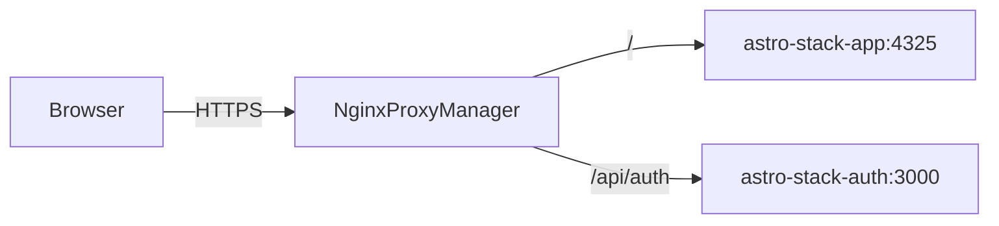

# Getting Started (VPS)

Step-by-step guide to deploy Astro Business Stack on a VPS with a public IP. This walkthrough uses `stack.ilurodigital.com` and `/opt/webfactory/astro-business-stack` as examples — adjust domain and paths for your setup.

For workflow details, rollback, and troubleshooting after setup, see [deployment.md](deployment.md).

## Prerequisites

- VPS with a **public IP**, Docker, and Docker Compose installed
- A domain you control (DNS + TLS via Nginx Proxy Manager)
- Access to this GitHub repository
- [Nginx Proxy Manager](https://nginxproxymanager.com/) running on the VPS (or an equivalent reverse proxy)

## 1. Create a deploy user (recommended)

On the VPS as root, create a dedicated user for deployments:

```bash
sudo adduser deploy
sudo usermod -aG docker deploy
```

Why:

- Deployments run as a non-root user
- The `deploy` user can run `docker compose` via the `docker` group
- CI SSH access is scoped to one account with its own `authorized_keys`

Switch to the deploy user for the remaining VPS steps:

```bash
sudo su - deploy
```

## 2. SSH keys — two different keys

You need **two separate key pairs**. Do not reuse the same key for both purposes.

| Key | Purpose | Where the private key lives |
|-----|---------|----------------------------|
| **Git deploy key** | VPS `git fetch` / `git clone` from GitHub | VPS only (`~/.ssh/astro-business-stack`) |
| **CI → VPS key** | GitHub Actions SSH into the VPS | GitHub secret `SSH_PRIVATE_KEY`; public key in `deploy` user's `authorized_keys` |

### 2a. Git deploy key (VPS → GitHub)

Generate the key as the `deploy` user:

```bash
ssh-keygen -t ed25519 -C "astro-business-stack" -f ~/.ssh/astro-business-stack
```

Add a host alias in `~/.ssh/config`:

```
Host github-astro-business-stack
  HostName github.com
  User git
  IdentityFile ~/.ssh/astro-business-stack
  IdentitiesOnly yes
```

Set permissions:

```bash
chmod 600 ~/.ssh/config ~/.ssh/astro-business-stack
chmod 644 ~/.ssh/astro-business-stack.pub
```

In GitHub: **Repository → Settings → Deploy keys → Add deploy key**

- Title: `astro-business-stack-vps`
- Key: contents of `~/.ssh/astro-business-stack.pub`
- **Allow write access**: off (read-only is enough; the deploy workflow only fetches)

### 2b. CI → VPS key (GitHub Actions → VPS)

Generate a second key (still on the VPS, or on your local machine):

```bash
ssh-keygen -t ed25519 -C "gha-to-vps" -f ~/.ssh/gha-vps
```

Add the **public** key to the deploy user's `authorized_keys`:

```bash
mkdir -p ~/.ssh
chmod 700 ~/.ssh
cat ~/.ssh/gha-vps.pub >> ~/.ssh/authorized_keys
chmod 600 ~/.ssh/authorized_keys
```

Copy the **private** key (`~/.ssh/gha-vps`) — you will store it in GitHub as `SSH_PRIVATE_KEY` in step 7.

Test from your machine (optional):

```bash
ssh -i gha-vps deploy@YOUR_VPS_IP
```

## 3. Clone the repository on the VPS

As the `deploy` user:

```bash
sudo mkdir -p /opt/webfactory
sudo chown deploy:deploy /opt/webfactory
git clone git@github-astro-business-stack:andreu-oulqaid/astro-business-stack.git /opt/webfactory/astro-business-stack
cd /opt/webfactory/astro-business-stack
git checkout main
```

Replace `andreu-oulqaid` with your GitHub org or username if you forked the repo.

## 4. GitHub OAuth App

Decap CMS needs a GitHub OAuth App for editor login. See [cms-oauth.md](cms-oauth.md) for the full auth flow.

1. GitHub → **Settings → Developer settings → OAuth Apps → New OAuth App**
2. **Authorization callback URL**: `https://stack.ilurodigital.com/api/auth/callback`
3. Copy the **Client ID** and **Client Secret**

You will add these to the VPS `.env` in the next step. The callback URL must exactly match `AUTH_GATEWAY_URL/api/auth/callback`.

## 5. Configure `.env` on the VPS

The `.env` file lives on the server only — it is never committed to git.

```bash
cd /opt/webfactory/astro-business-stack
cp .env.example .env
nano .env   # or your preferred editor
```

Required values for **production** (`main` branch):

```bash
SITE_URL=https://stack.ilurodigital.com
AUTH_GATEWAY_URL=https://stack.ilurodigital.com

APP_CONTAINER_NAME=astro-stack-app
AUTH_CONTAINER_NAME=astro-stack-auth
APP_IMAGE=astro-stack
AUTH_IMAGE=astro-stack-auth

GITHUB_CLIENT_ID=your_oauth_client_id
GITHUB_CLIENT_SECRET=your_oauth_client_secret
```

- `SITE_URL` — canonical URL for sitemap, OG images, and canonical links
- `AUTH_GATEWAY_URL` — public URL where `/api/auth` is reachable (no trailing slash)
- Container and image names must match what Nginx Proxy Manager will forward to

Optional integrations (Resend, Notion, Supabase, Cal.com, etc.) are documented in [integrations.md](integrations.md).

## 6. DNS

At your domain registrar or DNS provider, create an **A record**:

| Type | Name | Value |
|------|------|-------|
| A | `stack` | Your VPS public IP |

Result: `stack.ilurodigital.com` → VPS.

Wait for DNS propagation before requesting Let's Encrypt certificates in NPM.

## 7. GitHub Actions secrets

The deploy workflow uses GitHub **Environments**: `production` (for `main`) and `test` (for `develop`).

Go to **Repository → Settings → Environments** and create `production` (and `test` if you use staging).

Add these secrets to the `production` environment:

| Secret | Example value |
|--------|---------------|
| `SSH_HOST` | VPS IP or hostname |
| `SSH_USER` | `deploy` |
| `SSH_PRIVATE_KEY` | Full private key from `gha-vps` (step 2b) |
| `DEPLOY_PATH_PROD` | `/opt/webfactory/astro-business-stack` |

For staging (`develop` branch), add to the `test` environment:

| Secret | Example value |
|--------|---------------|
| `DEPLOY_PATH_TEST` | `/opt/webfactory/astro-stack-test` |

`SSH_HOST`, `SSH_USER`, and `SSH_PRIVATE_KEY` can be shared across environments or set per environment.

> **Note:** Changes under `docs/**` do not trigger deploy (see `paths-ignore` in the workflow). Pushing only documentation updates will not run the deploy job.

## 8. First manual deploy on the VPS

Create the shared Docker network (if it does not exist yet):

```bash
docker network create web-public 2>/dev/null || true
```

Build and start containers:

```bash
cd /opt/webfactory/astro-business-stack
docker compose build
docker compose up -d
```

Verify containers are running:

```bash
docker compose ps
```

The GitHub Actions workflow also creates `web-public` if missing, but you need containers up **before** NPM can proxy traffic to them.

### CMS config placeholder (optional)

The deploy workflow substitutes `AUTH_GATEWAY_URL` into `public/admin/config.yml` automatically. If you want to test `/admin` before the first CI deploy:

```bash
AUTH_GATEWAY_URL="$(grep ^AUTH_GATEWAY_URL= .env | cut -d= -f2- | tr -d '\r')"
sed -i "s|__AUTH_GATEWAY_URL__|$AUTH_GATEWAY_URL|g" public/admin/config.yml
```

## 9. Nginx Proxy Manager

NPM terminates TLS and routes traffic to Docker containers on the `web-public` network. Both `app` and `auth-gateway` must be reachable by **container name**.

See [infra/nginx-proxy-manager.example.md](../infra/nginx-proxy-manager.example.md) for full reference. Recommended setup (**same domain, path routing**):

### Main site proxy host

| Setting | Value |
|---------|-------|
| Domain | `stack.ilurodigital.com` |
| Scheme | `http` |
| Forward hostname | `astro-stack-app` |
| Forward port | `4325` |
| SSL | Let's Encrypt |

### Auth gateway routes

Add custom locations (or a second proxy host) for OAuth:

| Path | Forward hostname | Port |
|------|------------------|------|
| `/api/auth` | `astro-stack-auth` | `3000` |
| `/api/auth/callback` | `astro-stack-auth` | `3000` |

Request flow:



**Alternative:** Use a subdomain (`auth.stack.ilurodigital.com`) for the gateway. Set `AUTH_GATEWAY_URL` to that subdomain and register the matching callback in the OAuth App. See the NPM example doc for Option B.

## 10. Verify end-to-end

### HTTP check

```bash
curl -I https://stack.ilurodigital.com
```

Expect `200` or `301`/`302` with a valid TLS certificate.

### GitHub Actions deploy

Push to `main` and confirm the **Deploy to VPS** workflow completes successfully under the `production` environment.

### CMS login

1. Open `https://stack.ilurodigital.com/admin`
2. Click login — you should be redirected to GitHub OAuth
3. After authorizing, Decap CMS should load with your content collections

If OAuth fails with a redirect mismatch, double-check the callback URL in the OAuth App matches `AUTH_GATEWAY_URL/api/auth/callback` exactly.

---

## Quick checklist

Copy this checklist when onboarding a new production site.

### VPS and access

- [ ] Create `deploy` user and add to `docker` group
- [ ] Generate Git deploy key: `ssh-keygen -t ed25519 -C "astro-business-stack" -f ~/.ssh/astro-business-stack`
- [ ] Add `Host github-astro-business-stack` to `~/.ssh/config`
- [ ] GitHub: add deploy key (read-only) on the repository
- [ ] Generate CI key: `ssh-keygen -t ed25519 -C "gha-to-vps" -f ~/.ssh/gha-vps`
- [ ] Add `gha-vps.pub` to `deploy` user's `~/.ssh/authorized_keys`

### Repository and config

- [ ] Clone to `/opt/webfactory/astro-business-stack` on `main`
- [ ] DNS: `stack.ilurodigital.com` → VPS A record
- [ ] Copy `.env.example` → `.env` and set:
  - [ ] `SITE_URL=https://stack.ilurodigital.com`
  - [ ] `AUTH_GATEWAY_URL=https://stack.ilurodigital.com`
  - [ ] Production container/image names (`astro-stack-app`, `astro-stack-auth`, etc.)
  - [ ] `GITHUB_CLIENT_ID` and `GITHUB_CLIENT_SECRET`
- [ ] GitHub OAuth App with callback `https://stack.ilurodigital.com/api/auth/callback`

### Docker and proxy

- [ ] `docker network create web-public` (if missing)
- [ ] First manual deploy:
  ```bash
  cd /opt/webfactory/astro-business-stack
  docker compose build
  docker compose up -d
  ```
- [ ] NPM: proxy host for app (`astro-stack-app:4325`)
- [ ] NPM: `/api/auth` and `/api/auth/callback` → `astro-stack-auth:3000`
- [ ] NPM: Let's Encrypt SSL enabled

### CI and verification

- [ ] GitHub environment `production` secrets: `SSH_HOST`, `SSH_USER`, `SSH_PRIVATE_KEY`, `DEPLOY_PATH_PROD`
- [ ] `curl -I https://stack.ilurodigital.com`
- [ ] Push to `main` → GitHub Actions deploy succeeds
- [ ] Test `/admin` CMS login (GitHub OAuth)

### Optional: test environment (`develop`)

- [ ] Clone to `/opt/webfactory/astro-stack-test` on `develop`
- [ ] Separate `.env` with test container names and `AUTH_GATEWAY_URL`
- [ ] Separate OAuth App (or additional callback URL) for test domain
- [ ] NPM proxy hosts for test domain
- [ ] GitHub environment `test` secret: `DEPLOY_PATH_TEST`
- [ ] Push to `develop` → deploy to test environment

## Related docs

- [Deployment](deployment.md) — workflow behavior, prod vs test, troubleshooting
- [CMS & OAuth](cms-oauth.md) — Decap CMS and auth gateway details
- [Architecture](architecture.md) — VPS layout and request flows
- [Integrations](integrations.md) — optional Resend, Notion, Supabase, etc.
